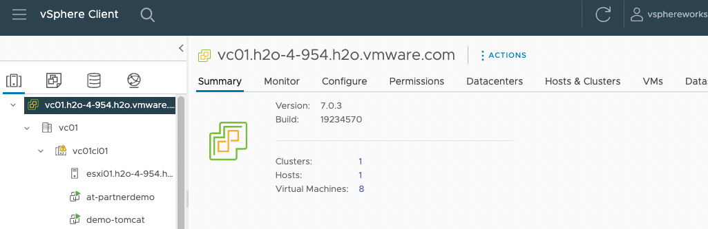

<p style="color:blue"><strong> Click here to test the execution in terminal</strong></p>

```execute-1
echo "Hello, Welcome to Partner workshop session"
```

<p style="color:blue"><strong> Click here to check Kubectl version</strong></p>

```execute
kubectl version
```

<p style="color:blue"><strong> Export session name as env variable</strong></p>

```execute-all
export SESSION_NAME={{ session_namespace }}
```

```dashboard:create-dashboard
name: vcenter Server
url: https://vc01.h2o-4-1115.h2o.vmware.com/ui/
```


<p style="color:blue"><strong> Login to vCenter using below creds</strong></p>

  |     User Name             |    Password     |
  |    ----------------       |    ---------    |
  |  partnersetkgs-w01-s001@vsphere.local |    Welcome11!   |
  
 <p style="color:blue"><strong> Verfify the vCenter settings</strong></p>

After successful login, Click on Hosts and Cluster > expand vcenter 



```dashboard:create-dashboard
name: TMC
url: https://partnertanzuseamericas.tmc.cloud.vmware.com/clusters
```

<p style="color:blue"><strong> Export session name as env variable</strong></p>

```execute-all
export SESSION_NAME={{ session_namespace }}
```


